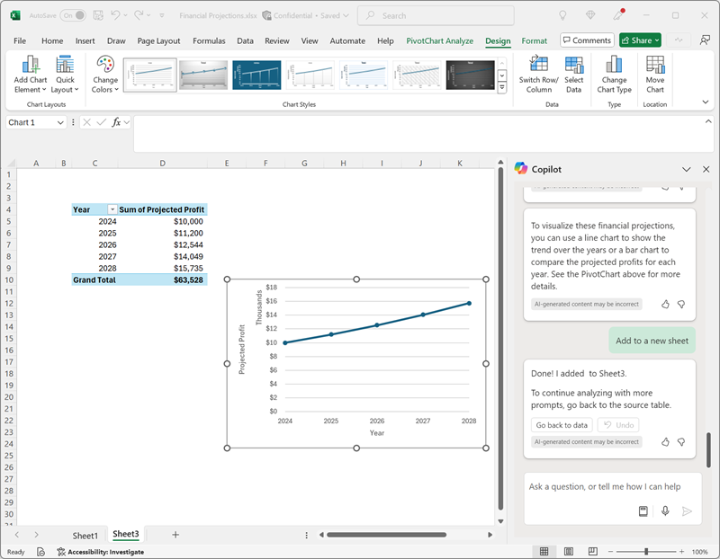

---
lab:
  title: Microsoft 365 Copilot erkunden
---
# Microsoft 365 Copilot erkunden

Willkommen in der aufregenden Welt von Microsoft 365 Copilot!

In dieser Übung werden Sie die Leistungsfähigkeit von Copilot nutzen, um eine neue Geschäftsidee zu erkunden: die Gründung eines Reinigungsunternehmens.

Stellen Sie sich Folgendes vor: Sie sind dabei, einen erstklassigen Reinigungsservice auf den Markt zu bringen, der die Büroräume überall revolutionieren wird. Mit Microsoft Copilot an Ihrer Seite werden Sie Markttrends recherchieren und einen soliden Geschäftsplan entwickeln. Aber das ist noch nicht alles. Außerdem erstellen Sie überzeugende Dokumente, aufmerksamkeitsstarke Präsentationen und überzeugende E-Mails, um Ihre Idee auf den Weg zu bringen und Investoren zu gewinnen.

Machen Sie sich bereit, Ihre Kreativität und Ihren Geschäftssinn zu entfesseln, während Sie sich durch dieses ansprechende und interaktive Lab bewegen. Am Ende dieser Übung werden Sie über ein umfassendes Material verfügen, das Sie auf den Weg zum unternehmerischen Erfolg bringt. Lassen Sie uns die ersten Schritte unternehmen und Ihr Reinigungsunternehmen in die Tat umsetzen!

Diese Übung dauert ca. **40** Minuten.

> **Hinweis**: Diese Übung erfordert eine **Microsoft 365 Copilot** Lizenz.

## Verwenden von Copilot, um ein Dokument zu erkunden und für eine Idee zu recherchieren

Wenn Sie mit der Erkundung von generativer KI beginnen möchten, verwenden Sie Copilot für Word, um ein vorhandenes Dokument zu untersuchen und einige Erkenntnisse daraus zu extrahieren.

1. Öffnen Sie in einem Webbrowser das Dokument [Geschäftsidee.docx](https://github.com/MicrosoftLearning/mslearn-copilot/raw/main/Allfiles/Business%20Idea.docx) unter `https://github.com/MicrosoftLearning/mslearn-copilot/raw/main/Allfiles/Business%20Idea.docx`. 
1. Laden Sie die Datei in Ihren Ordner **Downloads** herunter. Schließen Sie anschließend den Webbrowser.
1. Sie können das eben heruntergeladene Dokument per **Verschieben** oder **Kopieren und einfügen** im **OneDrive**-Ordner ablegen.
1. Öffnen Sie in Ihrem **OneDrive**-Ordner die Datei **Business Idea.docx** in Microsoft Word. (Schließen Sie alle Begrüßungsnachrichten oder Benachrichtigungen über neue Features.) Überprüfen Sie das Dokument, in dem einige allgemeine Ideen für eine Reinigungsfirma in New York City beschrieben werden. Wählen Sie bei entsprechender Aufforderung **Bearbeitung aktivieren** aus.

    > **Tipp**: Sie können den **Navigationsbereich** schließen, wenn er geöffnet ist, um mehr vom Dokument zu sehen.

1. Suchen Sie auf der Word-Symbolleiste das Symbol **Copilot**, und wählen Sie es aus, um den Bereich „Copilot“ zu öffnen, wie hier gezeigt (Ihr visuelles Design kann davon abweichen):

    

1. Geben Sie im Bereich „Copilot“ den folgenden Prompt im Textbereich unten ein:

    ```prompt
    Summarize this document into 5 key points, and suggest next steps.
    ```

1. Überprüfen Sie die Antwort von Copilot, die die wichtigsten Punkte im Dokument zusammenfassen sollte, wie hier gezeigt:

    

    > Die spezifische Antwort, die Sie erhalten, kann aufgrund der Art der generativen KI variieren.

    Wir hoffen, dass Copilot einige nützliche Hinweise gegeben hat. Wenn Sie jedoch weitere Fragen haben, können Sie einfach nach genaueren Informationen fragen.

1. Kehren Sie zum Copilot-Bereich zurück, um Copilot die folgende Frage zu stellen:

    ```prompt
    How do I setup a new business in New York? Answer with a numbered list.
    ```

1. Sehen Sie sich die Antwort an, und stellen Sie bei Bedarf weitere Fragen. Wenn Sie mit der Antwort zufrieden sind, verwenden Sie das Symbol **Kopieren** (&#128461;) unterhalb der Antwort, um sie in die Zwischenablage zu kopieren. Fügen Sie es nach dem bestehenden Text in das Word-Dokument ein. Markieren Sie dann den Text, der eine Liste von Dingen enthält, die bei der Gründung eines Unternehmens in New York zu tun sind, und verwenden Sie das Copilot-Symbol (am unteren Rand des markierten Textes), um den Text als Tabelle zu visualisieren.

    

1. Überprüfen Sie die Tabelle und bitten Sie Copilot, weitere Informationen hinzuzufügen, z. B. eine Spalte mit Referenzen für weitere Details.  Ihre Antwort sollte ungefähr wie folgt aussehen (möglicherweise müssen Sie die Schaltfläche **Erneut generieren** verwenden):

    

    > **Wichtig:** Die KI-generierte Antwort basiert auf öffentlichen Informationen aus dem Web. Sie kann Ihnen zwar helfen, die für eine Unternehmensgründung erforderlichen Schritte zu verstehen, es ist aber nicht garantiert, dass sie zu 100 % korrekt ist, und sie ersetzt nicht die Notwendigkeit einer professionellen Beratung!

1. Wenn Sie mit der von Copilot generierten Tabelle zufrieden sind, wählen Sie die Option **Beibehalten** aus.

## Verwenden von Copilot zum Erstellen von Inhalten für einen Geschäftsplan

Sie haben eine erste Recherche durchgeführt. Nun hilft Copilot Ihnen beim Entwickeln eines Geschäftsplans für Ihre Reinigungsfirma.

1. Das Dokument **Business Idea.docx** ist noch geöffnet. Geben Sie im Bereich „Copilot“ den folgenden Prompt ein:

    ```prompt
    Can you suggest a name for my cleaning business?
    ```

1. Sehen Sie sich die Vorschläge an und wählen Sie einen Namen für Ihr Reinigungsunternehmen aus (oder fahren Sie mit der Aufforderung fort, weitere Vorschläge einzuholen, um einen Namen zu finden, der Ihnen gefällt).
1. Erstellen eines neuen leeren Dokuments Wählen Sie dann im neuen Dokument das Copilot-Symbol am Rand, um neue Inhalte zu entwerfen. Geben Sie den folgenden Prompt ein, und ersetzen Sie **Contoso Cleaning** durch den Firmennamen Ihrer Wahl:

    ```prompt
    Write a business plan for "Contoso Cleaning" based on the information in /Business Idea.docx. Include an executive summary, market overview, and financial projections.
    ```

    

    > **Tipp**: Geben Sie die Aufforderung ein. Wenn Sie „/“ eingeben, sollte Copilot Ihnen ermöglichen, die Dokumente in Ihrem OneDrive-Ordner zu durchsuchen. Wenn Copilot keine Dokumente vorschlägt, liegt das möglicherweise daran, dass Ihr OneDrive noch nicht vollständig indiziert wurde. In diesem Fall ändern Sie die Eingabeaufforderung in `Write a business plan for "Contoso Cleaning", a commercial cleaning buisness in New York. Include an executive summary, market overview, and financial projections.`.

1. Generieren und Überprüfen einer Antwort. Dann behalten Sie sie bei, passen Sie den Tonfall und die Länge an oder bitten Sie Copilot, sie mit einer neuen Aufforderung neu zu schreiben. Fügen Sie Ihrem Dokument geeignete Überschriften und Formatierungen hinzu, damit es professionell aussieht, bevor Sie es als **Geschäftsplan.docx** in Ihrem OneDrive Ordner speichern. Ihr Dokument sollte in etwa so aussehen:

    

## Visualisieren von Finanzprognosen in Copilot für Excel

Sie besitzen nun einen Geschäftsplan und können jetzt Copilot in Excel bitten, einige dieser Daten zu Finanzprognosen für Sie zu visualisieren, damit Sie sie in E-Mails oder Präsentationen für Investoren einfügen können.

1. Wenn Sie das Dokument **Geschäftsplan** in Microsoft Word geöffnet haben, öffnen Sie den Bereich Copilot.
1. Wenn der generierte Geschäftsplan eine Liste der erwarteten Gewinne enthält, geben Sie die folgende Eingabeaufforderung ein:

    ```prompt
    Create a table of the projected profits in this document.
    ```

    Andernfalls geben Sie diese Aufforderung ein:

    ```prompt
    Create a table of projected profits for the next 5 years, starting with this year. The profit this year should be $10,000 and it should increase by 12% each year.
    ```

1. Kopieren Sie die Tabelle der prognostizierten Gewinne in die Zwischenablage.
1. Öffnen Sie **Excel**, und erstellen Sie eine neue, leere Arbeitsmappe. Speichern Sie die Arbeitsmappe sofort als **Finanzprognosen.xlsx** in Ihrem OneDrive-Ordner.
1. Fügen Sie die Tabelle der Gewinnprognosen in das Excel-Arbeitsblatt ein und **formatieren Sie sie als Tabelle**. Gehen Sie hierzu folgendermaßen vor:
    1. Wählen Sie eine **Zelle** innerhalb der Daten aus.
    1. Wählen Sie **Start** und unter „Formatvorlagen“ die Option **Als Tabelle formatieren** aus. 
    1. Wählen Sie ein Format für die Tabelle aus.
    1. Bestätigen Sie im Dialogfeld **Tabelle erstellen** den Zellbereich, oder legen Sie ihn fest.
    1. Markieren Sie, ob die Tabelle Überschriften enthält, und wählen Sie **OK** aus.
1. Wenn Sie die Umsatzprognosen als Tabelle formatiert haben, öffnen Sie den Bereich „Copilot“ über die Registerkarte **Start** des Excel-Menübands, und geben Sie den folgenden Prompt ein:

    ```prompt
    Suggest ways to visualize these financial projections.
    ```
    
1. Copilot sollte eine Möglichkeit zum Visualisieren Ihrer Daten und zum Hinzufügen einer PivotChart zu einer neuen Tabelle vorschlagen.

    

    > **Tipp**: Wenn Copilot ein anderes Format für die Daten vorschlägt, geben Sie die Folgeaufforderung `Visualize the data as a line chart.` ein.

1. Wählen Sie die Option in der Copilot-Antwort, um das Pivot-Diagramm zu einem neuen Blatt hinzuzufügen und es zu öffnen. Wählen Sie das Chart und dann **Entwurf** aus, um Formatvorlagen anzuwenden, den Diagrammtyp zu ändern und andere Aktionen auszuführen. Am Ende etwa Folgendes angezeigt werden:

    

1. Speichern Sie die Arbeitsmappe, und schließen Sie Excel.

Sie haben gerade Daten verwendet, die von Copilot in Word erstellt wurden, um sie in Excel zu visualisieren. In der nächsten Übung werden Sie Copilot in Outlook verwenden, um E-Mails zu der von Ihnen erledigten Arbeit zu verfassen und zu senden.

## Verwenden von Copilot zum Erstellen von Inhalten für eine Präsentation

Mit der Hilfe von Copilot haben Sie einen Entwurf eines Geschäftsplans für die Geschäftsidee Reinigung erstellt und einige Finanzprognosen vorbereitet. Jetzt benötigen Sie eine effektive Präsentation, um die Vorteile Ihres Unternehmens zu kommunizieren.

1. Öffnen Sie **PowerPoint**, und eröffnen Sie eine neue **leere Präsentation**. Wenn der Bereich **Designer** automatisch geöffnet wird, schließen Sie ihn.
1. Speichern Sie die Präsentation unter **Cleaning Company.pptx** in Ihrem OneDrive-Ordner.
1. Wählen Sie auf der Registerkarte **Start** des Menübands die Schaltfläche **Copilot** und dann **Präsentation erstellen zu...** aus. Schließen Sie dann den Prompt im Bereich „Copilot“ wie folgt ab:

    ```prompt
    Create a presentation about a corporate cleaning service named "Contoso Cleaning" in New York City. The presentation should include the benefits of using a professional cleaning business.
    ```

1. Copilot generiert Folien in der Präsentation.  Der Vorgang kann mehrere Minuten dauern, und die Ausgabe sollte ungefähr wie folgt aussehen:

    

1. Wählen Sie die vorletzte Folie der Präsentation aus (vor der abschließenden *Schlussfolgerung*, wenn Copilot eine solche Folie erstellt hat). Wählen Sie dann im Bereich Copilot in der Chatbox das Symbol **Prompts anzeigen** aus und wählen Sie die Eingabeaufforderung **Eine Folie hinzufügen über …** aus, um eine neue Folie mit der Aufforderung `Add a slide about the benefits of an eco-friendly approach to cleaning.` zu erstellen

    

1. Speichern Sie die Präsentation und schließen Sie PowerPoint.

## Verwenden Sie Copilot, um ein Finanzierungsgespräch zu vereinbaren

Sie haben einige Begleitmaterialien erstellt, die Ihnen bei den ersten Schritten mit Ihrem Unternehmen helfen sollen. Jetzt ist es an der Zeit, einen Investor zu finden, um eine Startfinanzierung zu erhalten.

1. Öffnen Sie **Outlook**, und verwenden Sie in der Titelleiste das Symbol **Copilot**, um den Bereich Copilot zu öffnen.
1. Wechseln Sie zur Seite **Kalender** und ändern Sie die Ansicht auf **Arbeitswoche**. Wenn Sie für diese Woche noch keine Termine in Ihrem Kalender haben, können Sie ein paar hinzufügen, damit Copilot einige Informationen zur Verfügung hat, mit denen er arbeiten kann.
1. Geben Sie im Copilot-Bereich den folgenden Prompt ein:

    ```
    What events do I have scheduled this week?
    ```

    Copilot sollte Ihnen eine Übersicht über Ihre geplanten Termine in dieser Woche geben und Ihnen dabei helfen, freie Termine für ein Treffen mit dem Bankmanagement zu finden, um eine Startfinanzierung zu vereinbaren.

1. Wechseln Sie auf die Seite **Mail** und erstellen Sie eine neue E-Mail. Füllen Sie das Feld **An** mit Ihrer eigenen E-Mail-Adresse.
1. Wählen Sie die Option **Entwurf mit Copilot**:

    
    
1. Geben Sie die folgende Aufforderung ein, um einen E-Mail-Entwurf zu erstellen:

    ```prompt
    Write an email to a bank manager requesting a meeting to discuss funding for a commercial cleaning business. The email should be concise and the tone should be professional.
    ```

1. Verwenden Sie Copilot, um den Inhalt der E-Mail zu optimieren, und wählen Sie dann **Beibehalten**, um die Nachricht fertig zu stellen.

    

1. Sie können die E-Mail an sich selbst senden, wenn Sie möchten.

## Herausforderung

Jetzt haben Sie gesehen, wie Sie mit Microsoft 365 Copilot Ideen recherchieren und Inhalte generieren können. Möchten Sie noch mehr entdecken? 

Versuchen Sie auf der Grundlage dessen, was Sie in dieser Übung gelernt haben, mit Copilot ein Meeting zu planen, in dem Sie die Einführung von generativer KI in Ihrem Unternehmen vorschlagen. Hier einige Beispiele:

- Recherchieren Sie die Vorteile von generativer KI und Microsoft Copilot für Unternehmen und finden Sie Informationen über Produktivitätsvorteile, Kosteneinsparungen und Beispiele von Unternehmen, die KI bereits erfolgreich eingesetzt haben.
- Erstellen Sie ein Diskussionspapier, das Sie vor der Besprechung als Vorablektüre verteilen können.
- Erstellen Sie eine Präsentation, mit der Sie Ihre Argumente darlegen können, einschließlich Daten und Visualisierungen, um die Schlüsselelemente Ihrer Präsentation hervorzuheben.
- Verfassen Sie eine E-Mail, in der Sie Ihre Mitarbeitenden über das Treffen informieren und den Kontext des Treffens darlegen.

Sie können so erfinderisch sein, wie Sie möchten. Entdecken Sie, wie Copilot Ihnen bei der Suche nach Informationen, der Erstellung und Optimierung von Texten, bei der Erstellung von Bildern sowie bei der Beantwortung von Fragen helfen kann.

## Zusammenfassung

In dieser Übung haben Sie [Microsoft 365 Copilot](https://www.microsoft.com/microsoft-365/enterprise/copilot-for-microsoft-365) verwendet, um Informationen zu finden und Inhalte zu erstellen. Sie haben hoffentlich gesehen, wie die Verwendung von generativer KI in einem Copilot die Produktivität und Kreativität steigern kann. Mit Microsoft 365 können Sie die Leistungsfähigkeit von generativer KI auf Ihre Geschäftsdaten und -prozesse übertragen und gleichzeitig in Ihre vorhandene IT-Infrastruktur integrieren, um eine verwaltbare, sichere Lösung zu gewährleisten.
