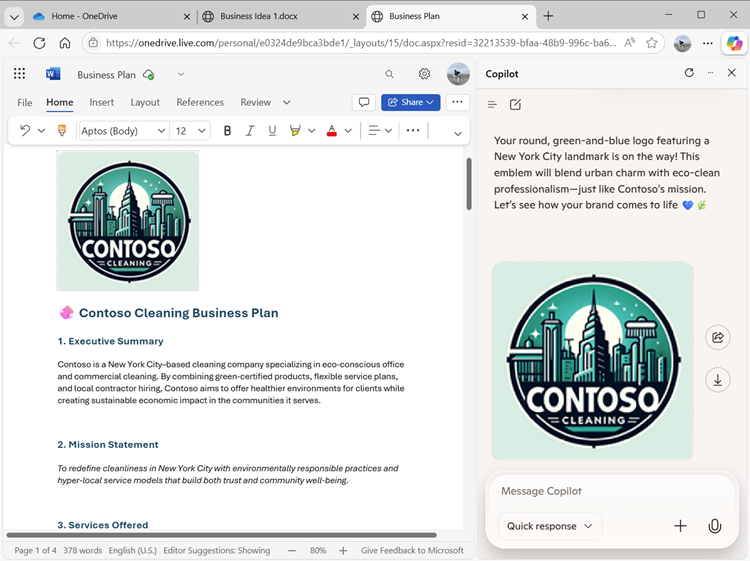
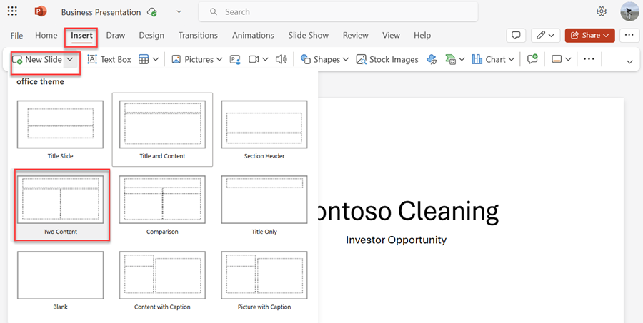
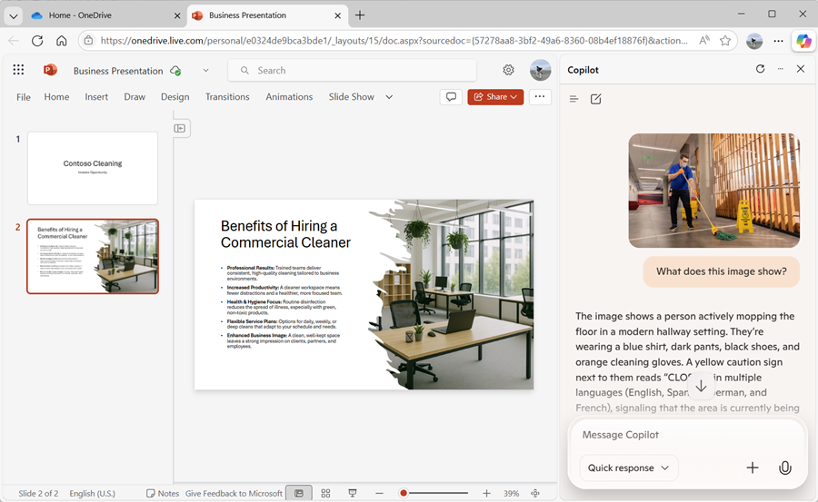

---
lab:
  title: Erkunden von Copilot in Microsoft Edge
---
# Erkunden von Microsoft Copilot in Microsoft Edge

Willkommen in der aufregenden Welt von Microsoft Copilot!

In dieser Übung werden Sie die Leistungsfähigkeit von Copilot nutzen, um eine neue Geschäftsidee zu erkunden: die Gründung eines Reinigungsunternehmens.

Stellen Sie sich Folgendes vor: Sie sind dabei, einen erstklassigen Reinigungsservice auf den Markt zu bringen, der die Büroräume überall revolutionieren wird. Mit Microsoft Copilot an Ihrer Seite werden Sie Markttrends recherchieren und einen soliden Geschäftsplan entwickeln. Aber das ist noch nicht alles. Außerdem erstellen Sie überzeugende Dokumente, aufmerksamkeitsstarke Präsentationen und überzeugende E-Mails, um Ihre Idee auf den Weg zu bringen und Investoren zu gewinnen.

Machen Sie sich bereit, Ihre Kreativität und Ihren Geschäftssinn zu entfesseln, während Sie sich durch dieses ansprechende und interaktive Lab bewegen. Am Ende dieser Übung werden Sie über ein umfassendes Material verfügen, das Sie auf den Weg zum unternehmerischen Erfolg bringt. Lassen Sie uns die ersten Schritte unternehmen und Ihr Reinigungsunternehmen in die Tat umsetzen!

> **Wichtig**: Diese Übung enthält Prompts, mit denen Sie mit Copilot arbeiten können. Sie sollten diese als *Ausgangspunkt* für Ihre Erkundung von Copilot verwenden. Sie werden aufgefordert, diese Prompts zu ändern und eigene Prompts hinzuzufügen, um einen iterativen Dialog mit Copilot zu führen und die erzeugten Ergebnisse zu verfeinern. Möglicherweise erhalten Sie nicht genau die Ausgabe, die in den Übungsanweisungen beschrieben wird, aber das ist OK – der Punkt besteht darin, mit Copilot zu experimentieren.

Diese Übung dauert ca. **40** Minuten.

> **Hinweis:** Bei dieser Übung wird davon ausgegangen, dass Sie über ein [persönliches Microsoft-Konto](https://signup.live.com) (z. B. ein Konto vom Typ „outlook.com“) verfügen, mit dem Sie auf Ihrem Computer bei [Microsoft Edge](https://www.microsoft.com/edge/download) angemeldet sind. Wenn Sie sowohl ein Arbeitskonto als auch ein persönliches Konto haben, stellen Sie sicher, dass Sie Ihr *persönliches* Konto in den Kontoeinstellungen oben links in Microsoft Edge auswählen.

## Verwenden von Copilot, um ein Dokument zu erkunden und für eine Idee zu recherchieren

Wenn Sie mit der Erkundung von generativer KI beginnen möchten, verwenden Sie Microsoft Copilot in Edge, um ein vorhandenes Dokument zu untersuchen und einige Erkenntnisse daraus zu extrahieren.

1. Navigieren Sie in Microsoft Edge zu [OneDrive](https://onedrive.live.com) unter `https://onedrive.live.com`, und melden Sie sich mit Ihrem persönlichen Microsoft-Konto an. Schließen Sie alle Begrüßungsnachrichten oder Angebote, die angezeigt werden.
1. Öffnen Sie auf einer anderen Browserregisterkarte das Dokument [Business Idea.docx](https://github.com/MicrosoftLearning/mslearn-copilot/raw/main/Allfiles/Business%20Idea.docx) von `https://github.com/MicrosoftLearning/mslearn-copilot/raw/main/Allfiles/Business%20Idea.docx`. Wenn das Dokument dann in Edge geöffnet wird, wählen Sie die Option **Kopie bearbeiten**, um das Dokument auf Ihr OneDrive zu kopieren. Das Dokument sollte dann automatisch in Microsoft Word Online geöffnet werden.

    > **Tipp**: Wenn Sie die Option zum Bearbeiten einer Kopie nicht sehen, laden Sie sie auf Ihren lokalen Computer herunter. Verwenden Sie dann in OneDrive die Schaltfläche **+ Neu hinzufügen**, um die Datei **Geschäftsidee.docx** von Ihrem lokalen Computer zu OneDrive hochzuladen.

1. Sehen Sie sich den Text im Dokument **Geschäftsidee** an, in dem einige übergeordnete Ideen für ein Reinigungsunternehmen in New York City beschrieben werden.
1. Verwenden Sie das Symbol **Copilot** auf der Edge-Symbolleiste, um den Copilot-Bereich zu öffnen, wie hier gezeigt:

    

    > **Tipp**: Microsoft Copilot wird ständig verbessert. Die Benutzeroberfläche stimmt möglicherweise nicht genau mit dem Bild überein, das angezeigt wird.

1. Geben Sie im Bereich „Copilot“ im Chatfeld unten den folgenden Prompt ein:

    ```prompt
    Summarize this document into 5 key points, and suggest next steps.
    ```

    Bestätigen Sie bei entsprechender Aufforderung, dass Sie Copilot den Zugriff auf die Seite gestatten möchten.

1. Prüfen Sie die Antwort von Copilot, die die wichtigsten Punkte des Dokuments zusammenfasst und einige Folgemaßnahmen vorschlägt, die Sie ergreifen können, wie hier gezeigt:

    

    > **Hinweis:** Die spezifische Antwort kann variieren.

    Wir hoffen, dass Copilot einige nützliche Hinweise gegeben hat. Wenn Sie jedoch weitere Fragen haben, können Sie einfach nach genaueren Informationen fragen.

1. Geben Sie den folgenden Prompt ein:

    ```prompt
    How do I go about setting up a business in New York?
    ```

1. Überprüfen Sie die Antwort, die einige Ratschläge und Links zu Ressourcen enthält, die Ihnen bei der Gründung eines Unternehmens in New York helfen sollen.

    > **Wichtig:** Die KI-generierte Antwort basiert auf öffentlichen Informationen aus dem Web. Sie kann Ihnen zwar helfen, die für eine Unternehmensgründung erforderlichen Schritte zu verstehen, es ist aber nicht garantiert, dass sie zu 100 % korrekt ist, und sie ersetzt nicht die Notwendigkeit einer professionellen Beratung!

## Verwenden von Copilot zum Erstellen von Inhalten für einen Geschäftsplan

Sie haben eine erste Recherche durchgeführt. Nun hilft Copilot Ihnen beim Entwickeln eines Geschäftsplans für Ihre Reinigungsfirma.

1. Das Dokument **Business Idea.docx** ist noch in Microsoft Edge geöffnet. Geben Sie im Bereich „Copilot“ den folgenden Prompt ein:

    ```prompt
    Suggest a name for my cleaning business.
    ```

1. Sehen Sie sich die Vorschläge an und wählen Sie einen Namen für Ihr Reinigungsunternehmen aus (oder fahren Sie mit der Aufforderung fort, weitere Vorschläge einzuholen, um einen Namen zu finden, der Ihnen gefällt). Wenn Sie sich für einen entschieden haben, teilen Sie Copilot mit, welcher es ist – geben Sie zum Beispiel `Let's go with the first one.` ein.
1. Vergewissern Sie sich, dass das Dokument **Geschäftsidee** noch auf der Hauptseite des Browsers geöffnet ist, und geben Sie dann die folgende Eingabeaufforderung ein:

    ```prompt
    Based on the contents of this document, create a business plan for my cleaning business.
    ```

1. Überprüfen Sie die Antwort. Erstellen Sie dann im Bereich Microsoft Word im Menü **Datei** ein neues leeres Dokument. Schließen Sie den Bereich **Designer**, falls er geöffnet ist, und ändern Sie den Namen des neuen Dokuments von *Dokument* in `Business Plan`.
1. Kopieren Sie den Geschäftsplan, der im Copilot-Bereich erstellt wurde, und fügen Sie ihn in das Geschäftsplandokument ein. Entfernen Sie dabei unnötigen Copilot-Inhalt:

    

1. Geben Sie im Copilot-Bereich den folgenden Prompt ein:

    ```prompt
    Create a corporate logo for the cleaning company. The logo should be round and include an iconic New York landmark.
    ```

1. Überprüfen Sie das Bild, das Copilot erstellt hat.

1. Verwenden Sie weitere Eingabeaufforderungen, um das Design zu iterieren (z. B. `Make it green and blue`), bis Sie ein Logo haben, das Ihnen gefällt.

    > **Tipp**: Wenn Coplot Bilder generiert, die Text enthalten, können Sie einige Rechtschreibfehler feststellen. Probieren Sie verschiedene Eingabeaufforderungen aus, bis Sie mit den Ergebnissen zufrieden sind.

1. Klicken Sie mit der rechten Maustaste auf das erzeugte Logo und kopieren Sie es in die Zwischenablage. Fügen Sie es dann wie folgt oben im Dokument für den Geschäftsplan ein:

    

1. Schließen Sie die Registerkarten des Microsoft Word-Browsers und kehren Sie zu Ihrem OneDrive zurück.

## Verwenden Sie Copilot zur Erstellung und Visualisierung von Finanzprognosen

Mit der Hilfe von Copilot haben Sie einen Entwurf eines Geschäftsplans für die Idee einer Reinigungsfirma erstellt. Lassen Sie uns nun mit Copilot einige Berechnungen durchführen, um den Businessplan weiter zu verfeinern.

1. Geben Sie im Copilot-Bereich den folgenden Prompt ein:

    ```prompt
    Create a table of projected profits for the next 5 years, starting with this year. The profit this year should be $10,000 and it should increase by 12% each year.
    ```

1. Überprüfen Sie die Antwort, die eine Tabelle mit den prognostizierten Gewinnen für die nächsten fünf Jahre enthalten sollte.
1. Wenn eine Option zum Bearbeiten der Tabelle in Excel angezeigt wird, wählen Sie sie aus, um eine neue Arbeitsmappe mit der Datentabelle zu erstellen. Kehren Sie andernfalls zur OneDrive-Registerkarte zurück, und verwenden Sie die Schaltfläche **(+)**, um eine neue **Excel-Arbeitsmappe** hinzuzufügen. Kopieren Sie dann die Datentabelle aus dem Bereich „Copilot“ in die Arbeitsmappe.

1. Ändern Sie dann den Namen der Arbeitsmappe in `Financial projections`. Es sollte in etwa wie folgt aussehen:

    

1. Geben Sie im Copilot-Bereich den folgenden Prompt ein:

    ```prompt
    What's a good way to visualize these projections in a chart?
    ```

1. Überprüfen Sie die Antwort, die Ihnen einige Möglichkeiten zur Visualisierung der Projektionen empfehlen sollte. Geben Sie dann die folgende Eingabeaufforderung ein:

    ```prompt
    How do I create a line chart in Excel?
    ```

1. Folgen Sie den Anweisungen von Copilot, um ein Liniendiagramm zu erstellen.

    > **Tipp**: Möglicherweise müssen Sie die von Excel ausgewählte Standard-Datenachse anpassen. Markieren Sie das Diagramm im Arbeitsblatt und wählen Sie auf der Registerkarte **Diagramm** die Option **Daten auswählen**. Ändern Sie dann im Bereich **Diagramm** auf der Registerkarte **Daten** die Einstellung so, dass das Feld **Jahr** die horizontale Beschriftung ist und nur das Feld **Gewinnprognose** als Linienwert verwendet wird:

    

1. Schließen Sie die Registerkarte **Diagramm**, um das Diagramm in der Kalkulationstabelle zu sehen.

1. Schließen Sie die Registerkarte des Microsoft Excel-Browsers und kehren Sie zu Ihrem OneDrive zurück.

## Verwenden von Copilot zum Erstellen von Inhalten für eine Präsentation

Dank Copilot haben Sie einen Geschäftsplan für Ihr Reinigungsunternehmen erstellt, sowie einige Finanzprognosen. Nun benötigen Sie eine wirkungsvolle Präsentation, um einen Investor davon zu überzeugen, Ihnen die finanziellen Mittel für die Gründung Ihres Unternehmens zu leihen.

1. Fügen Sie in OneDrive eine neue **PowerPoint-Präsentation** hinzu. Wenn der Bereich **Designer** automatisch geöffnet wird, schließen Sie ihn. Dann ändern Sie den Namen der Präsentation von *Präsentation* in `Business Presentation`.

1. Geben Sie auf der Titelfolie für die Präsentation den Namen Ihrer Reinigungsfirma als Titel und `Investor Opportunity` als Untertitel ein.
1. Fügen Sie eine neue Folie ein und verwenden Sie das Layout **Zwei Inhalte** (das einen Titel und zwei Platzhalter für den Inhalt enthält).
    

1. Ändern Sie den Folientitel in `Benefits of Hiring a Commercial Cleaner`.
1. Geben Sie im Copilot-Bereich den folgenden Prompt ein:

    ```prompt
    Write a summary of the benefits of using a corporate cleaning company for your business. The summary should consist of five short bullet points.
    ```

1. Kopieren Sie die Antwort von Copilot in die Zwischenablage, und fügen Sie sie in den linken Inhaltsplatzhalter ein. Bearbeiten und formatieren Sie dann den Text im Platzhalter, bis Sie zufrieden sind.
1. Geben Sie im Copilot-Bereich den folgenden Prompt ein:

    ```prompt
    Create a photorealistic image of a clean office.
    ```

1. Wenn Copilot ein Bild generiert hat, das Ihnen gefällt, kopieren Sie es in die Zwischenablage, und fügen Sie es in den Inhaltsplatzhalter rechts auf der Folie ein.

    Wenn der Bereich **Designer** automatisch geöffnet wird, wählen Sie ein Foliendesign aus, das Ihnen gefällt. Schließen Sie dann den Bereich **Designer**.

1. Formatieren Sie die Folie so lange um, bis Sie mit dem Ergebnis zufrieden sind:

    

1. Öffnen Sie eine neue Browser-Registerkarte und laden Sie damit das Bild [wischen.png](https://github.com/MicrosoftLearning/mslearn-copilot/raw/main/Allfiles/mopping.png) von `https://github.com/MicrosoftLearning/mslearn-copilot/raw/main/Allfiles/mopping.png` auf Ihren lokalen Computer herunter und speichern Sie es in einem beliebigen Ordner.
1. Kehren Sie zu der Browserregisterkarte zurück, die Ihre PowerPoint-Präsentation enthält, und verwenden Sie im Bereich „Copilot“ die Schaltfläche **+** neben dem Chat-Feld, um das Bild **wischen.png** in Copilot hochzuladen, und fügen Sie die Eingabeaufforderung `What does this image show?` hinzu.
1. Überprüfen Sie die Antwort, die in etwa wie folgt aussehen sollte:

    

1. Befolgen Sie die folgende Aufforderung und überprüfen Sie die Antwort:

    ```prompt
    Would this image be helpful to promote a commercial cleaning business?
    ```

    Copilot hat das Bild analysiert und seine Nützlichkeit für Ihr spezifisches Geschäftsszenario bewertet, so wie Sie auch die Meinung eines Kollegen einholen würden.

1. Fügen Sie in PowerPoint eine neue Folie mit dem gleichen **Zwei Inhalte** Layout wie zuvor hinzu. Dann laden Sie in einem der Inhaltsplatzhalter das Bild **wischen.png** hoch, um es der Folie hinzuzufügen.

1. Geben Sie im Copilot-Bereich den folgenden Prompt ein:

    ```prompt
    Write a short paragraph to accompany this image, emphasizing the professionalism of the cleaning staff we employ.
    ```

1. Überprüfen Sie den resultierenden Text und kopieren Sie ihn in den leeren Inhaltsplatzhalter auf der Folie. Bearbeiten und formatieren Sie ihn nach Bedarf.
1. Geben Sie im Copilot-Bereich den folgenden Prompt ein:

    ```prompt
    Suggest a good title for a slide that contains the image and text.
    ```

1. Verwenden Sie den vorgeschlagenen Titel für die Folie und verwenden Sie dann den Designer in PowerPoint, um die Folie zu formatieren. Am Ende sollten Sie eine ähnliche Folie wie diese erhalten:

    

1. Schließen Sie die Registerkarte des PowerPoint-Browsers und kehren Sie zu Ihrem OneDrive zurück.

## Verwenden Sie Copilot, um ein Finanzierungsgespräch zu vereinbaren

Sie haben einige Begleitmaterialien erstellt, die Ihnen bei den ersten Schritten mit Ihrem Unternehmen helfen sollen. Jetzt ist es an der Zeit, einen Investor zu finden, um eine Startfinanzierung zu erhalten.

1. Verwenden Sie das **App-Starfeld** (&#8759;) am linken Ende der OneDrive-Titelleiste, um **Outlook** zu öffnen.

1. Erstellen Sie auf die Seite **Mail** eine neue E-Mail. Füllen Sie das Feld **An** mit Ihrer eigenen E-Mail-Adresse aus und setzen Sie den **Betreff** auf `Business funding meeting request`.
1. Geben Sie im Copilot-Bereich den folgenden Prompt ein:

    ```prompt
    Write an email to a bank manager requesting a meeting to discuss funding for a commercial cleaning business. The email should be concise and the tone should be professional.
    ```
    
1. Verwenden Sie den generierten Inhalt, um Ihre E-Mails zu vervollständigen, wie hier gezeigt:

    

    Sie können die E-Mail an sich selbst senden, wenn Sie möchten.

## Herausforderung

Sie haben nun gesehen, wie Sie Copilot verwenden, um Ideen zu recherchieren und Inhalte zu generieren. Möchten Sie noch mehr entdecken? Um eine neue Copilot-Sitzung zu starten, wählen Sie im Menü **+** neben dem Chat-Feld **Neuen Chat starten**. Versuchen Sie dann, auf der Grundlage dessen, was Sie in dieser Übung gelernt haben, mit Copilot ein Meeting zu planen, in dem Sie die Einführung von generativer KI in Ihrem Unternehmen vorschlagen. Hier einige Beispiele:

- Recherchieren Sie die Vorteile von generativer KI und Microsoft Copilot für Unternehmen und finden Sie Informationen über Produktivitätsvorteile, Kosteneinsparungen und Beispiele von Unternehmen, die KI bereits erfolgreich eingesetzt haben.
- Erstellen Sie ein Diskussionspapier, das Sie vor der Besprechung als Vorablektüre verteilen können.
- Erstellen Sie eine Präsentation, mit der Sie Ihre Argumente darlegen können, einschließlich Daten und Visualisierungen, um die Schlüsselelemente Ihrer Präsentation hervorzuheben.
- Verfassen Sie eine E-Mail, in der Sie Ihre Mitarbeitenden über das Treffen informieren und den Kontext des Treffens darlegen.

Sie können so erfinderisch sein, wie Sie möchten. Entdecken Sie, wie Copilot Ihnen bei der Suche nach Informationen, der Erstellung und Optimierung von Texten, bei der Erstellung von Bildern sowie bei der Beantwortung von Fragen helfen kann.

## Zusammenfassung

In dieser Übung haben Sie Copilot in Microsoft Edge verwendet, um Informationen zu suchen und Inhalte zu generieren. Sie haben hoffentlich gesehen, wie die Verwendung von generativer KI in einem Copilot die Produktivität und Kreativität steigern kann.

Die kostenlosen Dienste, die in dieser Übung verwendet werden, sind zwar zweifellos sehr leistungsfähig, aber mit Diensten wie [Microsoft 365 Copilot](https://www.microsoft.com/microsoft-365/enterprise/copilot-for-microsoft-365) können Sie noch mehr erreichen. Microsoft Copilot ist in Windows und Microsoft Office-Produktivitätsanwendungen integriert und bietet eine stark kontextualisierte Hilfe bei gängigen Aufgaben. Mit Microsoft 365 können Sie die Leistungsfähigkeit von generativer KI auf Ihre Geschäftsdaten und -prozesse übertragen und gleichzeitig in Ihre vorhandene IT-Infrastruktur integrieren, um eine verwaltbare, sichere Lösung zu gewährleisten.